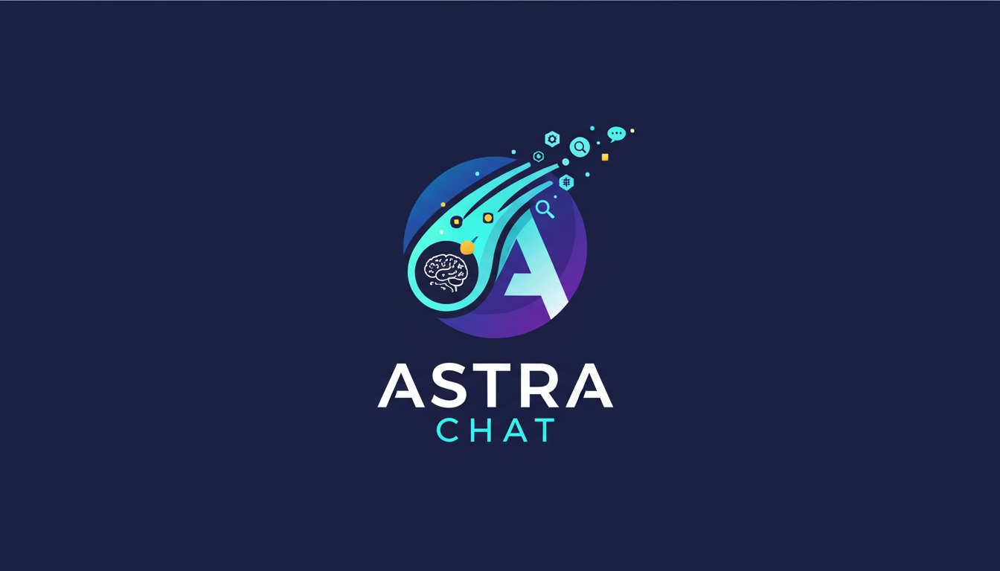

# AstraChat

[](https://github.com/NeKonnnn/AstraChat_AI_System) [](https://github.com/NeKonnnn/AstraChat_AI_System) [](https://github.com/NeKonnnn/AstraChat_AI_System) [](https://github.com/NeKonnnn/AstraChat_AI_System) [](https://github.com/NeKonnnn/AstraChat_AI_System) [](https://github.com/NeKonnnn/AstraChat_AI_System) [](https://github.com/NeKonnnn/AstraChat_AI_System)



## Что такое AstraChat?

AstraChat — это AI-платформа с микросервисной архитектурой, объединяющая приватность локальных моделей, масштабируемость облачных решений и интеллект агентной архитектуры для корпоративного использования. Платформа представляет собой интеллектуальный AI-ассистент с расширенными возможностями для работы с документами, голосовым взаимодействием и автоматизацией задач, построенный на основе передовых технологий машинного обучения.

## Основной функционал

### Микросервисная архитектура
- **LLM-сервис** — единый сервис для всех AI-моделей (LLM, транскрипция, синтез речи)
- **Backend** — основная бизнес-логика с агентной архитектурой
- **Frontend** — современный веб-интерфейс на React

### Агентная архитектура на LangGraph
- **Агент-оркестратор** — автоматический выбор и координация специализированных агентов
- **Специализированные агенты**:
  - DocumentAgent — работа с загруженными документами
  - WebSearchAgent — поиск информации в интернете
  - CalculationAgent — математические вычисления
  - MemoryAgent — работа с памятью системы
  - MCPAgent — интеграция с внешними сервисами
  - LangGraphAgent — планирование и выполнение сложных задач
- **Планирование задач** — многошаговое планирование сложных задач

### Мультимодальность
- **Транскрипция речи**: Vosk (быстрая) + WhisperX (точная)
- **Диаризация спикеров**: автоматическое разделение речи по говорящим
- **Синтез речи**: Silero TTS с несколькими голосами
- **Обработка документов**: PDF, DOCX, TXT, Markdown

### RAG система (Retrieval-Augmented Generation)
- **Векторный поиск** на базе PostgreSQL + pgvector
- **Семантический поиск** по загруженным документам
- **Контекстные ответы** на основе ваших документов

### Хранение данных
- **MongoDB** — хранение диалогов и истории общения
- **PostgreSQL + pgvector** — векторная база данных для RAG
- **MinIO** — хранение временных файлов и документов

### Реальное время
- **WebSocket** — потоковая передача ответов
- **Интерактивный чат** — мгновенные обновления интерфейса

---

## Установка Docker

Перед началом работы с AstraChat необходимо установить и запустить Docker на вашей системе.

### Установка Docker для Windows

1. Скачайте **Docker Desktop для Windows** с официального сайта:
   - https://www.docker.com/products/docker-desktop/

2. Запустите установщик и следуйте инструкциям мастера установки.

3. После установки запустите Docker Desktop и дождитесь полной загрузки (иконка Docker в системном трее должна быть активна).

4. Убедитесь, что Docker запущен, выполнив в командной строке или PowerShell:
   ```bash
   docker --version
   docker-compose --version
   ```

### Установка Docker для Linux

#### Ubuntu/Debian

```bash
# Обновляем список пакетов
sudo apt-get update

# Устанавливаем необходимые пакеты
sudo apt-get install -y ca-certificates curl gnupg lsb-release

# Добавляем официальный GPG ключ Docker
sudo mkdir -p /etc/apt/keyrings
curl -fsSL https://download.docker.com/linux/ubuntu/gpg | sudo gpg --dearmor -o /etc/apt/keyrings/docker.gpg

# Настраиваем репозиторий
echo \
  "deb [arch=$(dpkg --print-architecture) signed-by=/etc/apt/keyrings/docker.gpg] https://download.docker.com/linux/ubuntu \
  $(lsb_release -cs) stable" | sudo tee /etc/apt/sources.list.d/docker.list > /dev/null

# Устанавливаем Docker Engine и Docker Compose
sudo apt-get update
sudo apt-get install -y docker-ce docker-ce-cli containerd.io docker-compose-plugin

# Добавляем текущего пользователя в группу docker (чтобы не использовать sudo)
sudo usermod -aG docker $USER

# Перезапускаем сессию или выполняем:
newgrp docker
```

#### CentOS/RHEL/Fedora

```bash
# Устанавливаем необходимые пакеты
sudo yum install -y yum-utils

# Добавляем репозиторий Docker
sudo yum-config-manager --add-repo https://download.docker.com/linux/centos/docker-ce.repo

# Устанавливаем Docker Engine и Docker Compose
sudo yum install -y docker-ce docker-ce-cli containerd.io docker-compose-plugin

# Запускаем Docker
sudo systemctl start docker
sudo systemctl enable docker

# Добавляем текущего пользователя в группу docker
sudo usermod -aG docker $USER
newgrp docker
```

#### Проверка установки

После установки проверьте, что Docker работает:

```bash
docker --version
docker-compose --version
sudo systemctl status docker  # Для Linux
```

> **Важно**
> 
> Убедитесь, что Docker запущен и работает перед выполнением команд установки AstraChat. В Windows Docker Desktop должен быть запущен, в Linux — служба Docker должна быть активна.

---

## Быстрый старт с Docker

> **Примечание**
> 
> Для некоторых Docker-окружений могут потребоваться дополнительные настройки. Если вы столкнетесь с проблемами подключения, обратитесь к подробной документации проекта.

> **Важно**
> 
> При использовании Docker для установки AstraChat убедитесь, что вы правильно настроили монтирование томов для моделей и данных. Это критически важно для корректной работы системы и предотвращения потери данных.

> **Совет**
> 
> Для использования AstraChat с поддержкой GPU (CUDA) убедитесь, что на вашей системе установлен Nvidia CUDA container toolkit. Это необходимо для ускорения работы больших моделей.

## Подготовка к установке

После клонирования репозитория перейдите в директорию проекта и создайте необходимые папки:

```bash
# Перейдите в директорию проекта (замените путь на ваш)
cd /path/to/memo_new_api

# Создайте необходимые папки
mkdir venv_312 models diarize_models model_small silero_models whisperx_models
```

Эти папки используются для хранения:
- `venv_312` — виртуальное окружение Python (опционально, если не используете Docker)
- `models` — LLM модели и модели эмбеддингов
- `diarize_models` — модели для диаризации спикеров
- `model_small` — модели Vosk для быстрой транскрипции
- `silero_models` — модели Silero для синтеза речи
- `whisperx_models` — модели WhisperX для точной транскрипции

## Установка с конфигурацией по умолчанию

> **Важно: Docker должен быть запущен!**
> 
> Перед выполнением команд установки убедитесь, что Docker запущен и работает:
> - **Windows**: Docker Desktop должен быть запущен (проверьте иконку в системном трее)
> - **Linux**: Служба Docker должна быть активна (`sudo systemctl status docker`)

### Полная установка (все сервисы)

Для запуска всех компонентов системы (LLM-сервис, Backend, Frontend, базы данных) убедитесь, что вы находитесь в корневой директории проекта и выполните:

```bash
# Перейдите в директорию проекта (если еще не в ней)
cd /path/to/memo_new_api

# Запустите все сервисы
docker-compose up -d
```

Эта команда запустит:
- **LLM-сервис** на порту `8001`
- **Backend** на порту `8000`
- **Frontend** на порту `3000`
- **MongoDB** на порту `27017`
- **PostgreSQL** на порту `5432`
- **MinIO** на портах `9000` (API) и `9001` (Console)

После установки вы сможете получить доступ к AstraChat по адресу: **http://localhost:3000**

### Поэтапная установка

Если вы хотите запускать сервисы отдельно, убедитесь, что вы находитесь в корневой директории проекта:

```bash
# Перейдите в директорию проекта (если еще не в ней)
cd /path/to/memo_new_api
```

#### 1. Сначала запустите LLM-сервис:

```bash
docker-compose -f docker-compose-llm-svc.yml up -d
```

#### 2. Затем запустите Backend и базы данных:

```bash
docker-compose -f docker-compose-backend.yml up -d
```

#### 3. И наконец, запустите Frontend:

```bash
docker-compose -f docker-compose-frontend.yml up -d
```

## Установка с поддержкой GPU

Для использования GPU-ускорения при работе с большими моделями:

```bash
docker-compose up -d
```

Убедитесь, что в вашем `docker-compose.yml` настроены параметры GPU (если требуется). Для Linux/WSL необходимо установить Nvidia CUDA container toolkit.

## Настройка переменных окружения

Создайте файл `.env` в корне проекта на основе `env.example` и настройте следующие параметры:

### LLM-сервис
- `LLM_MODEL_PATH` — путь к LLM модели
- `LLM_MODEL_NAME` — имя модели
- `VOSK_MODEL_PATH` — путь к модели Vosk
- `SILERO_MODELS_DIR` — директория с моделями Silero
- `WHISPERX_MODELS_DIR` — директория с моделями WhisperX

### Базы данных
- `MONGODB_USER` — пользователь MongoDB
- `MONGODB_PASSWORD` — пароль MongoDB
- `POSTGRES_USER` — пользователь PostgreSQL
- `POSTGRES_PASSWORD` — пароль PostgreSQL
- `MINIO_ROOT_USER` — пользователь MinIO
- `MINIO_ROOT_PASSWORD` — пароль MinIO

### Сеть
- `LLM_SVC_INTERNAL_URL` — внутренний URL LLM-сервиса (по умолчанию: `http://llm-svc:8000`)
- `USE_LLM_SVC` — использование LLM-сервиса (по умолчанию: `true`)

## Проверка работы

После установки проверьте статус контейнеров:

```bash
docker-compose ps
```

Все сервисы должны быть в состоянии `Up` и `healthy`.

## Доступ к сервисам

- **Frontend**: http://localhost:3000
- **Backend API**: http://localhost:8000
- **LLM-сервис**: http://localhost:8001
- **MinIO Console**: http://localhost:9001

---

## Star History

[](https://www.star-history.com/#NeKonnnn/AstraChat_AI_System&type=date&legend=top-left)

---

**Приятного использования AstraChat!**